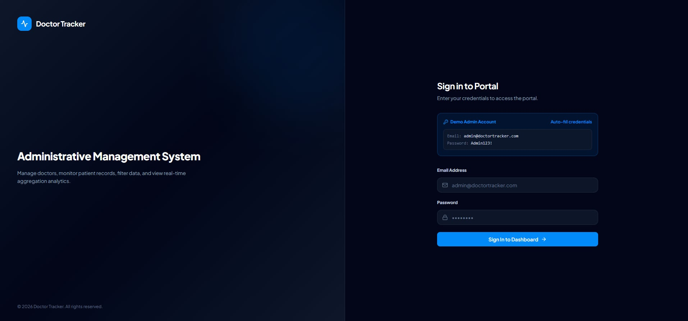
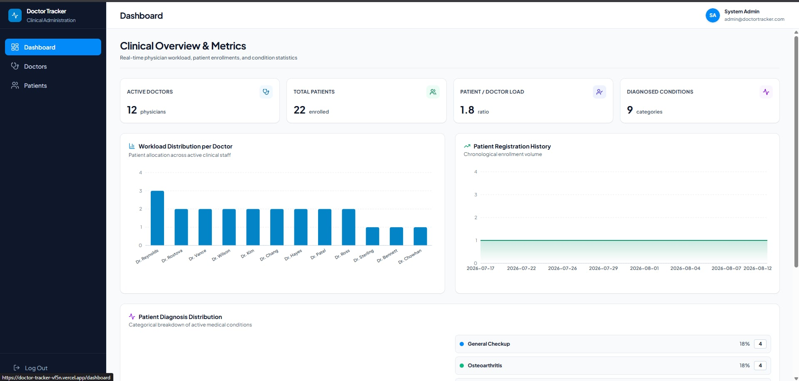
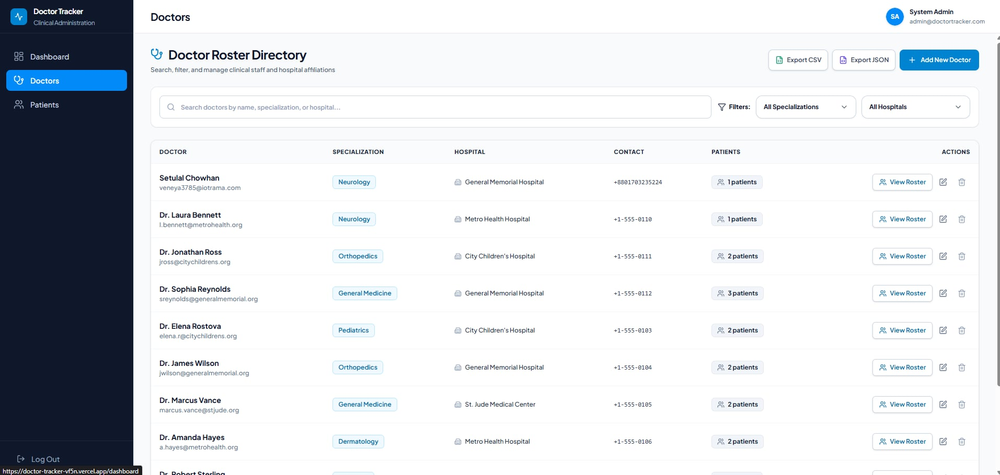
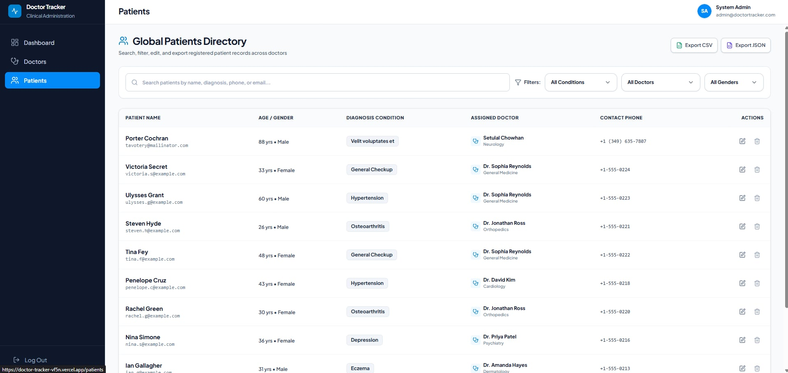
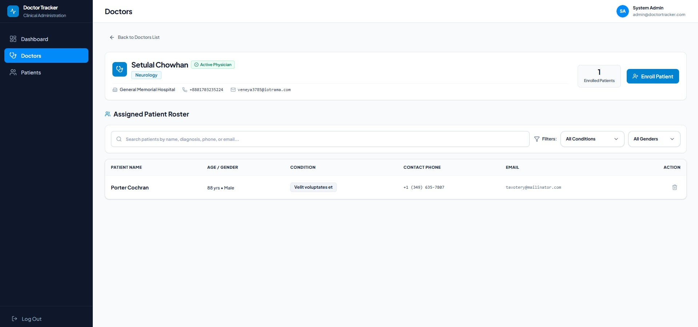
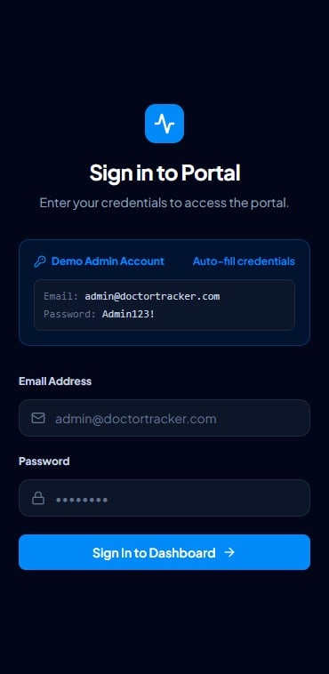
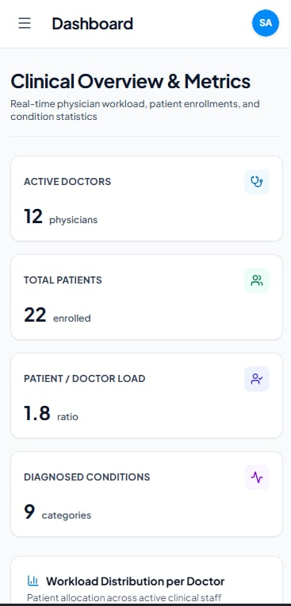
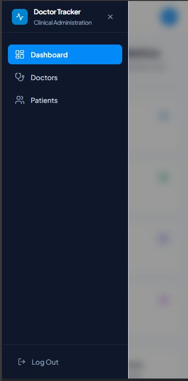

# Doctor Tracker — Clinical Administration & Patient Management System

## Description

**Doctor Tracker** is an enterprise-grade clinical administration and patient management web application designed for healthcare administrators to track physician workloads, manage doctor rosters, monitor patient enrollments, and analyze diagnostic distributions in real time. Built with performance optimization, clean UX hierarchy, dynamic analytics visualizations, and a responsive design system, Doctor Tracker enables seamless doctor-patient allocation, server-side multi-parameter search and filtering, and automated CSV/JSON data exports.

---

## Setup Guide

### Prerequisites
- **Node.js**: `v18.0.0` or higher
- **npm**: `v9.0.0` or higher
- **MongoDB**: Local MongoDB instance or MongoDB Atlas cluster connection string

---

### Step-by-Step Installation

#### 1. Repository Setup
```bash
git clone https://github.com/your-username/Doctor-Tracker.git
cd Doctor-Tracker
```

#### 2. Environment Variables Configuration (`.env.example`)
Environment configuration templates are provided at the root directory as well as in the backend and frontend modules:
- **Root Environment Template**: [`.env.example`](.env.example)
- **Backend Server Template**: [`server/.env.example`](server/.env.example)
- **Frontend Client Template**: [`client/.env.example`](client/.env.example)

---

#### 3. Backend Server Setup
Navigate into the `server` directory and install dependencies:
```bash
cd server
npm install
cp .env.example .env
```

*Configure environment variables in `server/.env`:*
```env
# Server Environment
PORT=5000
NODE_ENV=development

# Database Connection
MONGO_URI="mongodb+srv://<username>:<password>@cluster.mongodb.net/doctorTracker?retryWrites=true&w=majority"

# JWT Security Secrets
JWT_SECRET="doctor_tracker_jwt_secret_key_2026"
ACCESS_TOKEN_SECRET="doctor_tracker_access_secret_key_2026"
REFRESH_TOKEN_SECRET="doctor_tracker_refresh_secret_key_2026"

# Client CORS Origin
CLIENT_URL="http://localhost:3000"
```

##### Seed Initial Dataset (12 Doctors & 25 Patients)
```bash
npm run seed
```

##### Start Backend Server
```bash
npm run dev
```
*(Backend server runs on `http://localhost:5000`)*

---

#### 4. Frontend Client Setup
Open a new terminal window and navigate into the `client` directory:
```bash
cd client
npm install
cp .env.example .env.local
```

*Configure environment variables in `client/.env.local`:*
```env
# Public API Gateway Endpoint
NEXT_PUBLIC_API_URL="http://localhost:5000/api/v1"
```

##### Start Frontend Application
```bash
npm run dev
```
*(Frontend application runs on `http://localhost:3000`)*

---

### Demo Credentials

| Role | Email | Password |
| :--- | :--- | :--- |
| **Administrator** | `admin@doctortracker.com` | `Admin123!` |

---

## System Architecture

Doctor Tracker uses a decoupled client-server architecture. The Next.js frontend application handles dynamic clinical views and state revalidation, while communicating with a RESTful Express backend API backed by MongoDB Atlas.

```
┌────────────────────────────────────────────────────────┐
│              Next.js Frontend (Port 3000)              │
│  - App Router Layouts & Server/Client Components       │
│  - TanStack Query (Data Caching & Optimistic UI)      │
│  - Shadcn UI + Tailwind CSS Clinical Design System    │
└──────────────────────────┬─────────────────────────────┘
                           │ HTTP / REST API (JWT Bearer Token)
┌──────────────────────────▼─────────────────────────────┐
│             Node.js / Express Backend (Port 5000)       │
│  - JWT Authentication & Security Middleware           │
│  - Zod Request Schema Validation & CORS Management    │
│  - Server-Side Pagination, Filtering & Search Engines │
└──────────────────────────┬─────────────────────────────┘
                           │ Mongoose ODM Connections
┌──────────────────────────▼─────────────────────────────┐
│                 MongoDB Atlas Database                 │
│  - Compound Query Indexes ({ doctorId: 1, name: 1 })   │
│  - Doctor & Patient Schemas & Relational Mapping       │
└────────────────────────────────────────────────────────┘
```

### High-Level Data Flows
1. **Authentication Flow**: User submits credentials $\rightarrow$ Express backend verifies credentials and issues HttpOnly JWT access/refresh tokens $\rightarrow$ Client receives session context.
2. **Server-Side Search & Filter Flow**: User inputs search query $\rightarrow$ 300ms debounced input dispatch $\rightarrow$ Express API executes indexed Mongoose regex queries $\rightarrow$ Returns paginated payload with real-time UI re-rendering.
3. **Export Engine**: CSV and JSON report generation processed client-side from cached TanStack Query datasets for instant offline-capable downloads.

---

## Technical Decisions

### Decision 1: TanStack Query (React Query) over Redux & Context API for Server State Management
- **Context & Challenge**: Managing server-side remote data (doctor rosters, patient directory, search filters, pagination states) with global state stores like Redux or Context API requires significant boilerplate (actions, reducers, manual loading/error flags, refetching logic).
- **Why TanStack Query Was Chosen**:
  - **Automated Caching & Revalidation**: Built-in cache management, automatic background updates, window refocus refetching, and effortless query cache invalidation (`queryClient.invalidateQueries`).
  - **Optimistic Mutations**: Enables instant UI updates before server response confirmation, delivering a smooth experience for roster edits and patient assignments.
  - **Debounced Search Synergy**: Integrates seamlessly with debounced search states, preventing redundant API network requests while retaining UI responsiveness.

### Decision 2: Decoupled Express Backend & Next.js App Router over Monolithic Next.js API Routes
- **Context & Challenge**: While Next.js offers built-in API Routes, placing complex backend business logic, database connections, and custom middleware inside serverless route handlers can lead to MongoDB connection pool exhaustion and cold-start latency.
- **Why Decoupled Express Was Chosen**:
  - **Strict Separation of Concerns (SoC)**: Keeps security middleware, rate limiting, authentication, and database schemas completely decoupled from presentation logic.
  - **Persistent Database Connection Pool**: Maintains a persistent, warm Mongoose connection pool to MongoDB Atlas, eliminating connection overhead on serverless invocations.
  - **Microservices Ready**: Enables independent scaling, monitoring, and isolated deployment of the core API server.

---

## Visual Evidence

High-resolution screenshots illustrating Desktop and Mobile user interfaces are stored in the [`/screenshots`](screenshots) directory.

### Desktop Views

#### 1. Authentication & Security Page (Desktop)


#### 2. Clinical Overview Dashboard (Desktop)


#### 3. Doctor Roster Directory (Desktop)


#### 4. Global Patient Roster (Desktop)


#### 5. Patient Directory Filtered by Assigned Physician (Desktop)


---

### Mobile Views

#### 1. Mobile Login Page


#### 2. Mobile Clinical Dashboard


#### 3. Mobile Navigation & Drawer Sidebar

